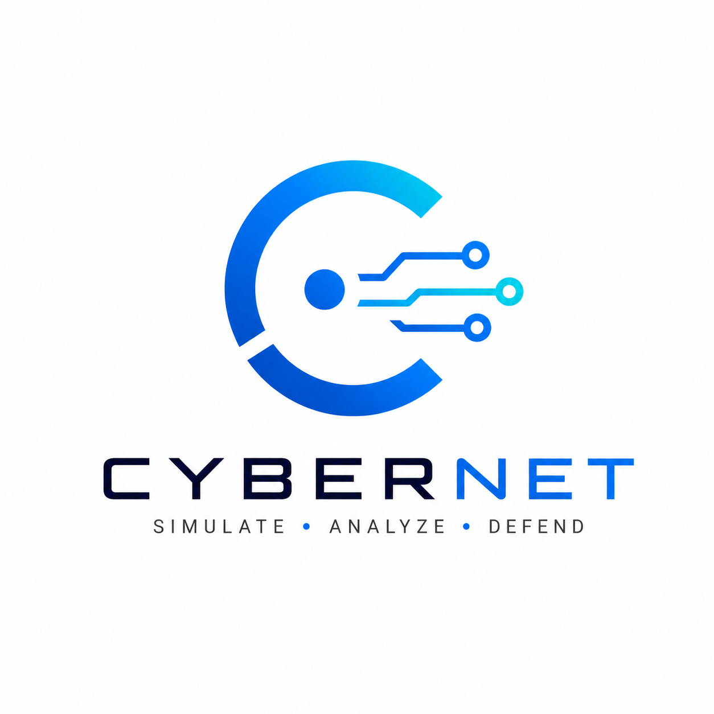
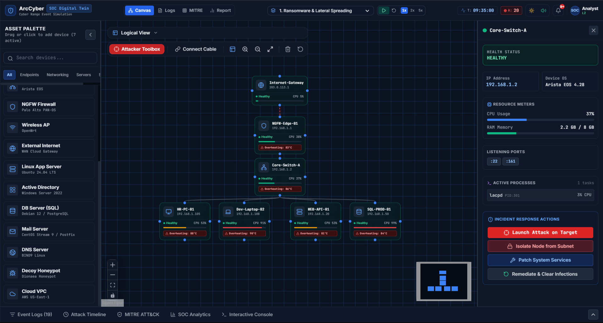
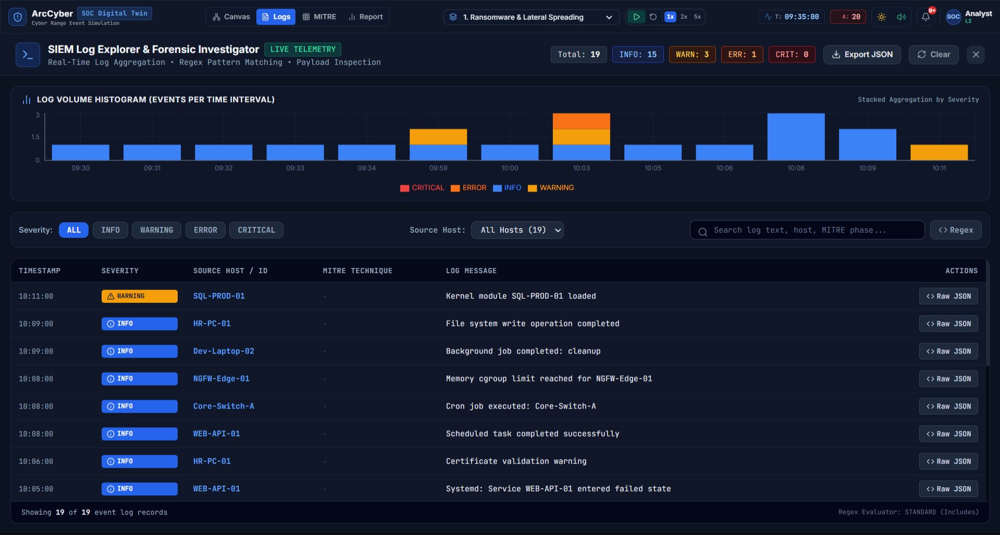
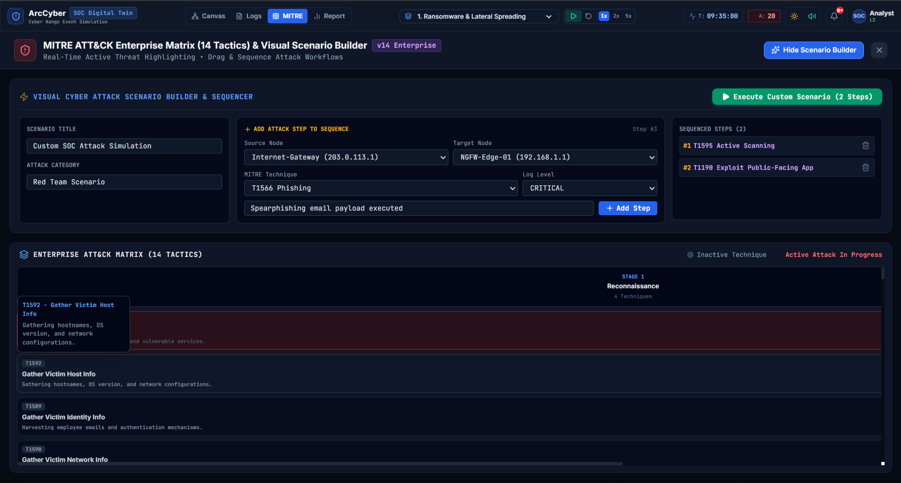
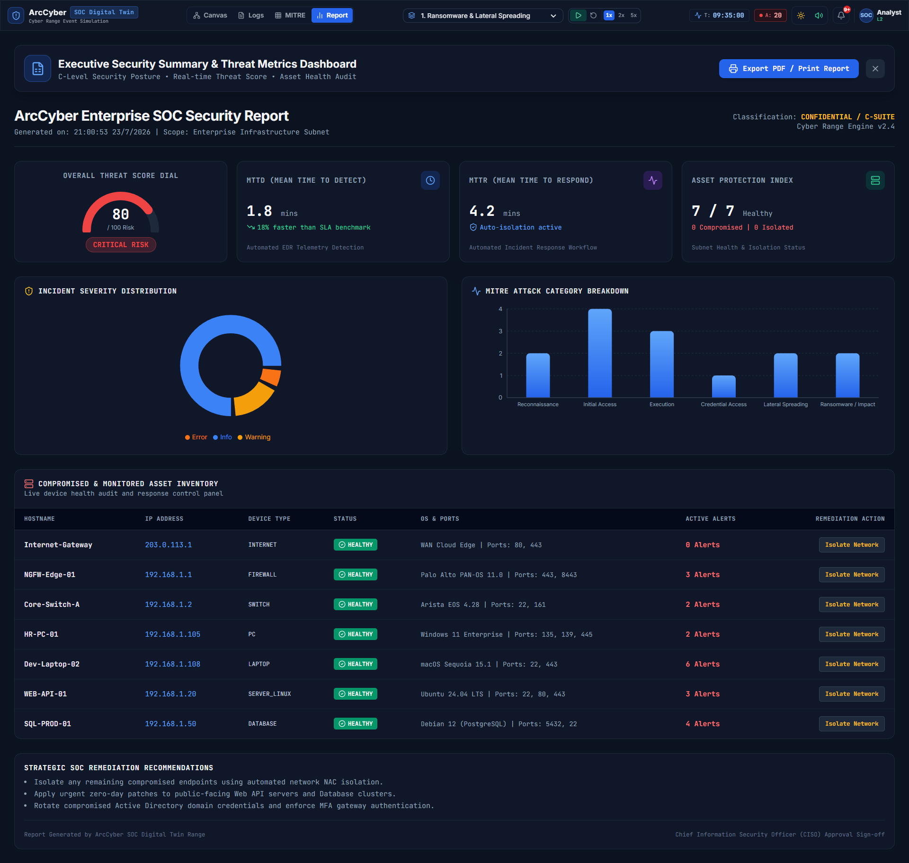

<div align="center">
  

  # Cyber SOC Digital Twin

  **Interactive Network Security Simulation Platform — Cyber Range & SOC Training Environment**

  [](https://react.dev)
  [](https://www.typescriptlang.org/)
  [](https://vite.dev)
  [](https://tailwindcss.com)
  [](https://xyflow.com)
  [](https://github.com/pmndrs/zustand)
  [](https://recharts.org)
  [](https://www.framer.com/motion/)
  [](LICENSE)

  <p align="center">
    <strong>Simulate. Detect. Respond. Learn.</strong>
  </p>

  <p align="center">
    <a href="#-overview">Overview</a> •
    <a href="#-key-features">Features</a> •
    <a href="#-tech-stack">Tech Stack</a> •
    <a href="#-getting-started">Getting Started</a> •
    <a href="#-architecture">Architecture</a> •
    <a href="#-usage-guide">Usage Guide</a> •
    <a href="#-test-scenarios">Scenarios</a> •
    <a href="#-contributing">Contributing</a>
  </p>

  <br />
</div>

---

## 📋 Overview

**ArcCyber SOC Digital Twin** is a browser-based cyber range simulation platform that allows security professionals, SOC analysts, and students to build, visualize, and attack network topologies in real time. The platform simulates a complete Security Operations Center (SOC) environment with live telemetry, traffic flows, process execution, user activity, log generation, and attack scenario execution — all mapped to the **MITRE ATT&CK®** framework.

> 🔐 **Train your blue team. Test your detection rules. Master incident response — all from your browser.**

### Why ArcCyber SOC Digital Twin?

- **Hands-On SOC Training** — Practice real-world attack detection and response without expensive lab infrastructure
- **MITRE ATT&CK Aligned** — Every attack scenario maps to real adversary tactics and techniques
- **Real-Time Simulation** — Tick-based engine drives device telemetry, network traffic, user behavior, and attack progression simultaneously
- **Browser-Native** — Zero deployment overhead. Built with modern web technologies for instant access


---

## ✨ Key Features

### 🕸️ Interactive Network Graph

- **Drag-and-Drop Canvas** — Build arbitrary network topologies by dragging devices (PCs, servers, routers, firewalls, IoT, honeypots, etc.) onto a **React Flow**-powered canvas
- **Visual Connection Tools** — Draw cables between devices with an intuitive connection mode
- **Real-Time Status Visualization** — Color-coded node health (healthy, warning, scanning, compromised, offline)
- **Multiple View Modes**:
  - **Logical** — Standard topology with device labels and connection lines
  - **Traffic Heatmap** — Overlay bandwidth utilization and packet flow intensity
  - **Health Overview** — Aggregate device health at a glance
  - **Threat Vectors** — Highlight compromised devices and attack propagation paths
- **Rich Interactions** — Multi-select, zoom, pan, auto-layout, minimap navigation

### ⚙️ Real-Time Simulation Engine

A modular, tick-based engine with **8 independently scheduled subsystems** running synchronously:

| Subsystem | Description |
|-----------|-------------|
| **📊 Telemetry** | CPU, RAM, disk, temperature, throughput metrics per device |
| **🌐 Traffic** | Network packets, bandwidth, latency, packet loss, routing metrics |
| **⚡ Processes** | Dynamic process spawning, execution, and termination per device profile |
| **🔧 Services** | Service lifecycle management with restart, stop, and failure events |
| **👥 Users** | Simulated user behavior — login, logout, file downloads, activity cycles |
| **📝 Logs** | Background event generation with categorized log streams (network, security, application, syslog) |
| **🚨 Alerts** | Severity-based alert generation (critical, high, medium, low) with toast notifications and audio siren |
| **💀 Attack** | Scheduled attack step execution advancing through MITRE ATT&CK stages |

- Adjustable simulation speed: **1× – 64×**
- Audio siren for critical alerts via **Web Audio API** (synthesized alert tones)

### 🎯 Attack Scenarios (MITRE ATT&CK)

- **14 Tactics** from the MITRE ATT&CK® framework — Reconnaissance → Resource Development → Initial Access → Execution → Persistence → Privilege Escalation → Defense Evasion → Credential Access → Discovery → Lateral Movement → Collection → Command & Control → Exfiltration → Impact
- **Pre-Built Attack Scenarios**:
  - **Ransomware Attack** — Classic ransomware compromise, encryption, and propagation
  - **Data Exfiltration** — Sensitive data stolen through C2 channels
  - **DDoS Campaign** — Volumetric DDoS against critical infrastructure
  - **APT Multi-Stage** — Advanced persistent threat spanning all 14 MITRE stages
  - **Insider Threat** — Malicious insider stealing credentials and exfiltrating data
- **Custom Scenarios** — Build and execute your own attack chains from the MITRE Matrix view
- **Manual Attacks** — Launch individual attacks from the Attacker Toolbox (Nmap, Brute Force, Ransomware, DDoS, Exfiltration)

### 🛡️ Incident Response Toolkit

- **Device Isolation** — Quarantine compromised nodes from the network
- **Process Termination** — Kill malicious processes on infected devices
- **Vulnerability Patching** — Apply virtual patches to secure vulnerabilities
- **Infection Clearing** — Remove malware and restore device integrity
- **Real-Time Feedback** — Immediate status updates and log entries for every response action

### 📊 Executive Reporting

- **C-Level Security Summary** — Asset inventory, severity distribution, timeline of key events
- **Real-Time Charts** — Traffic trends, alert distribution, component health breakdown via **Recharts**
- **Export-Ready** — Comprehensive report view suitable for after-action reviews

### 🖥️ SOC Professional Interface

- **Dark/Light Mode** — Eye-friendly dark mode with full theme support
- **Four Screen Modes**:
  - **Canvas** — Main network topology and simulation controls
  - **Logs** — SIEM-style log explorer with filtering and search
  - **MITRE** — 14-column ATT&CK Matrix with interactive scenario builder
  - **Report** — Executive security summary with charts and KPIs
- **Responsive Layout** — Collapsible sidebars, resizable bottom drawer, floating toolbars
- **Smooth Animations** — Powered by **Framer Motion 12**
- **Audio Alerts** — Web Audio API siren synthesizer for critical security events

---

## 📸 Screenshots

<div align="center">
  <h3>Network Canvas</h3>
  
  <br /><br />
  <h3>SIEM Log Explorer</h3>
  
  <br /><br />
  <h3>MITRE ATT&CK Matrix</h3>
  
  <br /><br />
  <h3>Executive Report</h3>
  
</div>

---

## 🧰 Tech Stack

| Layer | Technology | Purpose |
|-------|-----------|---------|
| **Framework** | React 19 + TypeScript 6 | Component architecture and type-safe development |
| **Build Tool** | Vite 8 | Lightning-fast HMR and optimized production builds |
| **Styling** | Tailwind CSS 3.4 (JIT, `class`-based dark mode) | Utility-first CSS with dark/light themes |
| **State Management** | Zustand 5 | Lightweight, hook-based store architecture (4 stores) |
| **Graph Visualization** | React Flow 12 (@xyflow/react) | Interactive node-edge topology canvas |
| **Charts** | Recharts 3 | Real-time telemetry and security charts |
| **Animations** | Framer Motion 12 | Smooth UI transitions and micro-interactions |
| **Icons** | Lucide React | Consistent, crisp SVG icon set |
| **Linting** | Oxlint | Fast Rust-based linter |
| **Audio** | Web Audio API | Synthesized alert siren tones |
| **UI Utilities** | clsx + tailwind-merge | Conditional class merging |

---

## 🏗️ Architecture

### High-Level Flow

```
┌──────────────────────────────────────────────────────────────────────────┐
│                            App (ReactFlowProvider)                       │
├──────────────────────────────────────────────────────────────────────────┤
│                                                                          │
│  ┌──────────────┐    ┌────────────────────────────────┐  ┌─────────────┐ │
│  │   Header     │    │        ReactFlow Canvas        │  │    Right    │ │ 
│  │ (Brand,      │    │  ┌───────┐ ┌───────┐ ┌───────┐ │  │  Inspector  │ │
│  │  Controls,   │    │  │SocNode│ │SocEdge│ │MiniMap│ │  │  (Device    │ │
│  │  Tabs)       │    │  └───────┘ └───────┘ └───────┘ │  │   Details)  │ │
│  └──────────────┘    │  ┌──────────────────────────┐  │  └─────────────┘ │
│                      │  │      ToolbarOverlay      │  │                  │
│  ┌──────────────┐    │  │       (View Modes)       │  │                  │
│  │    Left      │    │  └──────────────────────────┘  │                  │
│  │  Sidebar     │    └────────────────────────────────┘                  │
│  │ (Devices)    │    ┌────────────────────────────────┐                  │
│  └──────────────┘    │          Bottom Drawer         │                  │
│                      │   (Logs, MITRE, Traffic, KPIs) │                  │
│                      └────────────────────────────────┘                  │
├──────────────────────────────────────────────────────────────────────────┤
│                                                                          │ 
│  ┌───────────────┐  ┌─────────────┐  ┌───────────────┐  ┌──────────────┐ │
│  │  LogExplorer  │  │ MitreMatrix │  │  ExecReport   │  │   Attacker   │ │
│  │  (SIEM Logs)  │  │  (ATT&CK)   │  │ (Charts/KPI)  │  │   Toolbox    │ │
│  └───────────────┘  └─────────────┘  └───────────────┘  └──────────────┘ │
│                                                                          │
└──────────────────────────────────────────────────────────────────────────┘
                         ▲                          │
                         │      Store Updates       │  Actions
                         ▼                          ▼
┌────────────────────────────────────────────────────────────────────────────┐
│                              Zustand Stores                                │
│                                                                            │
│  ┌────────────────┐  ┌────────────────┐  ┌────────────────┐  ┌───────────┐ │
│  │ useGraphStore  │  │ useSimulation  │  │ useTelemetry   │  │ useUIStore│ │
│  │ (Nodes/Edges)  │  │ (Scenario/Step)│  │ (Logs/Alerts)  │  │ (Theme/   │ │
│  └────────────────┘  └────────────────┘  └────────────────┘  │  Mode)    │ │
│                                                              └───────────┘ │
│                                                                            │
└────────────────────────────────────────────────────────────────────────────┘
                         ▲
                         │                   Tick Events
                         ▼
┌──────────────────────────────────────────────────────────────────────────┐
│                            Simulation Engine                             │
│                                                                          │
│  ┌──────────┐  ┌──────────┐  ┌──────────┐  ┌──────────┐  ┌──────────┐    │
│  │ Telemetry│  │ Traffic  │  │ Process  │  │ Service  │  │   User   │    │
│  │  System  │  │  System  │  │  System  │  │  System  │  │  System  │    │
│  └──────────┘  └──────────┘  └──────────┘  └──────────┘  └──────────┘    │
│                                                                          │
│  ┌──────────┐  ┌──────────┐  ┌──────────────────┐                        │
│  │   Log    │  │  Alert   │  │     Attack       │                        │
│  │  System  │  │  System  │  │  System (Steps)  │                        │
│  └──────────┘  └──────────┘  └──────────────────┘                        │
│                                                                          │
└──────────────────────────────────────────────────────────────────────────┘
```

### Data Flow

1. **User Interactions** → React components dispatch actions to Zustand stores
2. **Store Updates** → Trigger React re-renders in subscribed components
3. **Simulation Engine** → Tick-based loop reads store state and writes telemetry/log/alert updates
4. **Services Layer** → Incident response, scenario execution, and attack services interact with stores
5. **UI Reflects State** → Real-time updates propagate through React's reactive rendering
---

## 🚀 Getting Started

### Prerequisites

- **Node.js** ≥ 22
- **npm** ≥ 10 (or pnpm / yarn)

### Installation

```bash
# Clone the repository
git clone https://github.com/thphz/projectaaa.git
cd projectaaa

# Install dependencies
npm install

# Start the development server
npm run dev
```

Open [http://localhost:5173](http://localhost:5173) in your browser.

### Build for Production

```bash
npm run build
npm run preview   # Preview the production build locally
```

### Lint

```bash
npm run lint
```

---

## 🎮 Usage Guide

1. **Explore the Network** — The canvas loads with a pre-built topology. Pan and zoom to explore.
2. **Add Devices** — Open the left sidebar and drag devices onto the canvas (PCs, servers, firewalls, routers, IoT, honeypots, etc.).
3. **Connect Devices** — Use the cable tool (⚡) to draw connections between nodes.
4. **Select a Scenario** — Pick a pre-built attack scenario from the header dropdown.
5. **Run Simulation** — Press ▶ **Play** to start the simulation engine.
6. **Launch Attacks** — Open the **Attacker Toolbox** (🎯) and target specific devices with Nmap, Brute Force, Ransomware, DDoS, or Exfiltration.
7. **Respond to Incidents** — Use the right inspector panel to:
   - Isolate compromised nodes
   - Kill malicious processes
   - Patch vulnerabilities
   - Clear infections
8. **Analyze Security Events** — View real-time logs in the bottom drawer, explore the SIEM Log Explorer, or check the MITRE ATT&CK Matrix.
9. **Switch Views** — Toggle between **Canvas**, **Logs**, **MITRE**, and **Report** screen modes.
10. **Generate Reports** — Open the Executive Report view for C-level security summaries with charts and KPIs.

### Controls

| Control | Description |
|---------|-------------|
| ▶ / ⏸ **Play/Pause** | Start or pause the simulation engine |
| ⏹ **Reset** | Reset simulation to initial state |
| **Speed 1×–64×** | Adjust simulation tick rate multiplier |
| **Dark/Light** | Toggle between dark and light theme |
| **🔊 Mute** | Enable or disable alert siren audio |
| **View Modes** | Switch between Logical, Traffic, Health, and Threat overlays |
---

## 🧪 Test Scenarios

| Scenario | Description | MITRE Stages |
|----------|-------------|--------------|
| **Ransomware Attack** | Classic ransomware compromise, file encryption, and network propagation | Recon → Resource Dev → Initial Access → Execution → Impact |
| **Data Exfiltration** | Sensitive data stolen through command & control channel | Recon → Credential Access → Collection → Exfiltration |
| **DDoS Campaign** | Volumetric distributed denial-of-service against critical servers | Recon → Resource Dev → Impact |
| **APT Multi-Stage** | Advanced persistent threat simulation across all MITRE tactics | All 14 stages |
| **Insider Threat** | Malicious insider stealing credentials and exfiltrating data | Recon → Credential Access → Collection → Exfiltration |
---

## 📁 Project Structure

```
projectaaa/
├── public/
│   ├── favicon.svg          # Browser tab favicon
│   └── logo.png             # Project logo
├── src/
│   ├── assets/              # Static assets
│   ├── components/          # React components
│   │   ├── Header.tsx           # Top bar with brand, controls, tabs
│   │   ├── LeftSidebar.tsx      # Device palette & drag source
│   │   ├── RightInspector.tsx   # Device details & incident response
│   │   ├── SocNode.tsx          # Custom React Flow node
│   │   ├── SocEdge.tsx          # Custom React Flow edge
│   │   ├── ToolbarOverlay.tsx   # View mode overlays
│   │   ├── BottomDrawer.tsx     # Bottom panel with logs/metrics
│   │   ├── LogExplorer.tsx      # Full-screen SIEM log viewer
│   │   ├── MitreMatrix.tsx      # MITRE ATT&CK 14-column matrix
│   │   ├── ExecutiveReport.tsx  # Executive security report
│   │   ├── AttackerToolboxModal.tsx  # Attack launcher modal
│   │   └── ToastNotificationStack.tsx # Alert toast notifications
│   ├── data/                # Mock data & device profiles
│   │   ├── mockData.ts          # Preset scenarios, palette items
│   │   └── deviceProfiles.ts    # Device capability profiles
│   ├── engine/              # Simulation engine
│   │   └── systems/             # Tick-based subsystems
│   │       ├── telemetrySystem.ts
│   │       ├── trafficSystem.ts
│   │       ├── processSystem.ts
│   │       ├── serviceSystem.ts
│   │       ├── userSystem.ts
│   │       ├── logSystem.ts
│   │       ├── alertSystem.ts
│   │       └── attackSystem.ts
│   ├── hooks/               # Custom React hooks
│   │   ├── useScheduler.ts      # Engine tick scheduler
│   │   ├── useDisplayEdges.ts   # Edge display logic
│   │   └── useSelectedNode.ts   # Selection state hook
│   ├── services/            # Business logic services
│   │   ├── incidentResponseService.ts
│   │   ├── scenarioService.ts
│   │   ├── nodeService.ts
│   │   └── attackService.ts
│   ├── store/               # Zustand state stores
│   │   ├── useGraphStore.ts       # Nodes, edges, selection
│   │   ├── useSimulationStore.ts  # Simulation state, scenarios
│   │   ├── useTelemetryStore.ts   # Logs, alerts, metrics
│   │   └── useUIStore.ts          # UI mode, theme, layout
│   ├── types/               # TypeScript type definitions
│   │   ├── engine.ts             # Engine system types
│   │   └── soc.ts                # SOC domain types
│   ├── utils/               # Utility functions
│   ├── App.tsx              # Root application component
│   ├── main.tsx             # Entry point
│   ├── index.css            # Global styles & Tailwind directives
│   └── App.css              # App-specific styles
├── index.html               # HTML entry
├── package.json
├── vite.config.ts
├── tailwind.config.js
├── postcss.config.js
├── tsconfig.json
└── tsconfig.app.json
```


---

## 🤝 Contributing

Contributions are welcome! If you'd like to add new attack scenarios, device profiles, improve the simulation engine, or enhance the UI, please follow these steps:

1. Fork the repository
2. Create a feature branch (`git checkout -b feature/amazing-feature`)
3. Commit your changes (`git commit -m 'Add amazing feature'`)
4. Push to the branch (`git push origin feature/amazing-feature`)
5. Open a Pull Request

### Development Guidelines

- Follow the existing code style and TypeScript conventions
- Ensure type safety — avoid `any` where possible
- Run `npm run lint` before committing
- Test scenarios should be included for new attack chain additions

---

## 📄 License

This project is licensed under the **MIT License**. See the [LICENSE](LICENSE) file for details.

---

## 🙏 Acknowledgments

- [MITRE ATT&CK®](https://attack.mitre.org/) — Comprehensive adversary tactics and techniques framework
- [React Flow](https://xyflow.com/) — Powerful graph visualization library
- [Tailwind CSS](https://tailwindcss.com) — Utility-first CSS framework
- [Zustand](https://github.com/pmndrs/zustand) — Minimalist state management
- [Recharts](https://recharts.org) — Composable chart library for React
- [Framer Motion](https://www.framer.com/motion/) — Animation library for React
- [Lucide](https://lucide.dev) — Beautiful open-source icons
- All open-source contributors whose libraries made this project possible

---

## 👤 Author

**Created and maintained by [@thphz](https://github.com/thphz)**

---

<div align="center">

**Built with ❤️ for the cybersecurity community**

**ArcCyber SOC Digital Twin** — *Simulate. Detect. Respond. Learn.*

</div>
